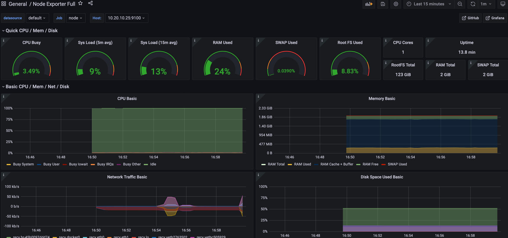

# astra-test-task
#### Test mission for astra corp
### Description

This repo runs vagrant vm and runs node-exporter & docker container with grafana and prometheus
Tested on MacOS Monterey 12.4 (21F79) with vmWare Fusion

#### Requirements

* Vagrant
* vmWare fusion
* vagrant-vmware-desktop >= 1.0.0

#### System requirements

1vCPU and 2Gb RAM free on your hypervisor host machine

#### Usage
1. Clone this repository on your host machine \
`git clone https://github.com/u-kosmonaft-u/astra-test-task.git`  
2. Go to the project directory \
`cd astra-test-task`
3. (_Optional_) Initialize vagrant if u have to \
`vagrant init`
4. Start virtual machine \
`vagrant up`
5. Wait until all task in provisioning vm will be done
6. Go to the `http://127.0.0.1:3000` on your host machine
   (grafana credentials are admin/admin)
7. Enjoy beautiful dashboard

#### Third-party content

For vagrant used: `generic/ubuntu2004` (https://app.vagrantup.com/generic/boxes/ubuntu2004)\
For dashboard used: `1860` (https://grafana.com/grafana/dashboards/1860)